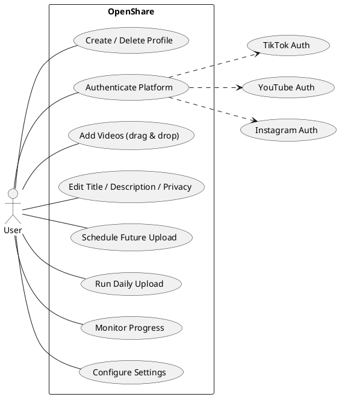
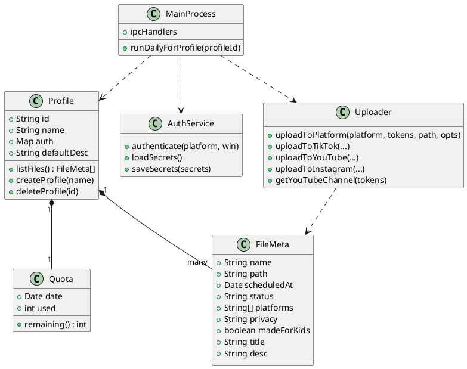
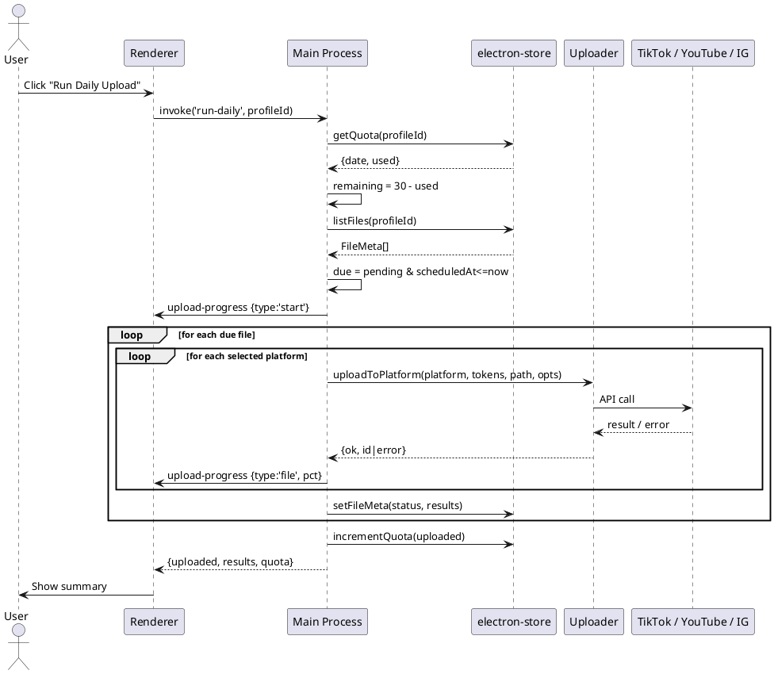
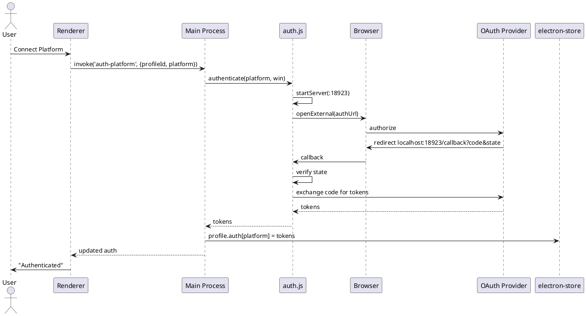
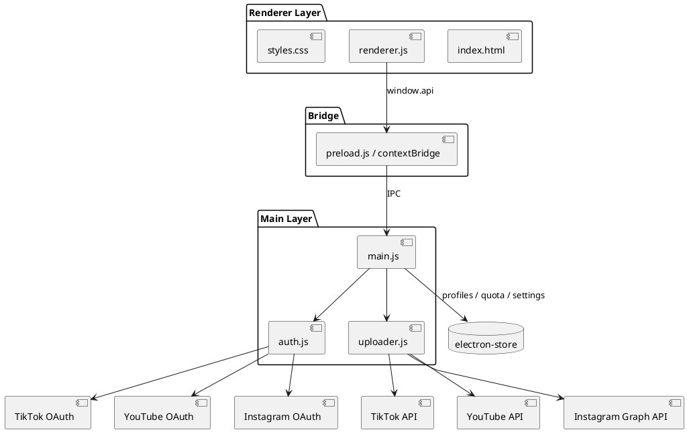
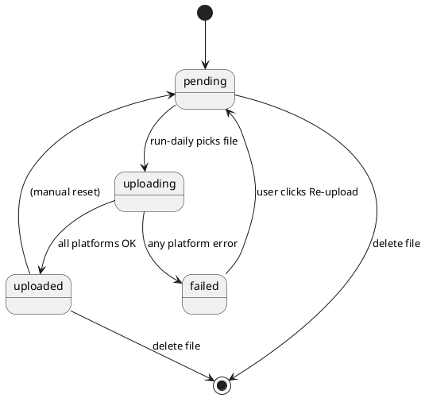

# OpenShare — UML Diagrams

> Diagrams are written in [PlantUML](https://plantuml.com/) syntax. You can
> render them with the PlantUML VS Code extension, the IntelliJ plugin, or the
> online server at https://www.plantuml.com/plantuml.

## 1. Use Case Diagram

## 2. Class Diagram

## 3. Sequence Diagram — Daily Upload Run

## 4. Sequence Diagram — OAuth Authentication

## 5. Component Diagram

## 6. State Diagram — File Lifecycle

